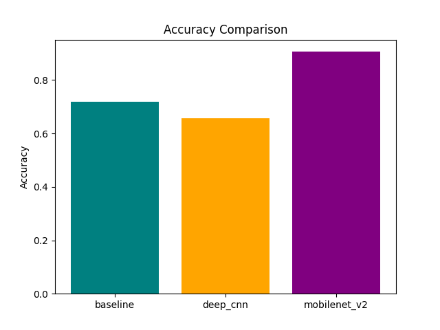
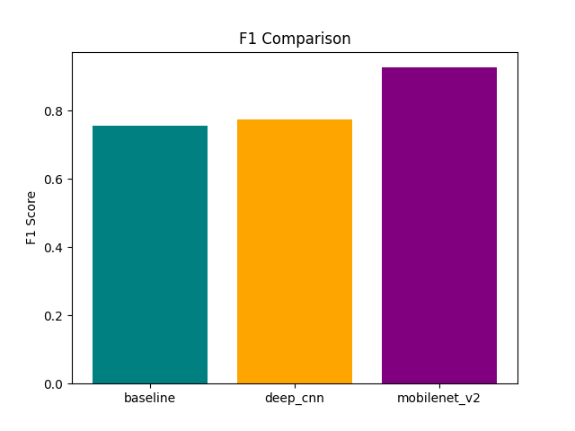

## 
Intelligent Image Classification System with Deep Learning 

A scalable deep-learning solution for categorizing images into two defined classes using both custom CNNs and transfer-learning models. The system provides organized training workflows, data processing steps, model benchmarking, comparison plots, preserved model artifacts, and a user-friendly Gradio interface for efficient real-time predictions.

#### Features

✔️ Multi-architecture training (Baseline CNN, Deep CNN, MobileNetV2)

✔️ Transfer learning for improved performance

✔️ Metrics stored in JSON for easy comparison

✔️ Accuracy & F1 visual charts

✔️ Gradio web interface for real-time predictions

✔️ Organized folder structure with saved models and sample images

#### Project Structure

Image Classification/

├── data/                     # Dataset source link

├── plots/                    # Accuracy & F1 comparison charts

├── saved_models/             # Trained model files (.keras)

├── image_classification_code.ipynb   # Full training & inference notebook

├── metrics_summary.json              # Evaluation metrics for all models

└── requirement.txt                   # Dependencies

#### Model Performance Summary

| Model         | Accuracy | F1 Score |
|---------------|----------|----------|
| Baseline CNN  | 0.7188   | 0.7568   |
| Deep CNN      | 0.6563   | 0.7755   |
| MobileNetV2   | 0.9063   | 0.9268   |

MobileNetV2 achieves the highest overall performance.

#### Performance Visuals

Inside the plots/ folder, you will find:

compare_accuracy.png

compare_f1.png

These provide clear model-to-model comparisons.

#### Model Performance Visualization

#### Model Checkpoints

All trained models are available in the saved_models/ directory:

-- baseline_cnn_best.keras

-- baseline_cnn_final.keras

-- deep_cnn_best.keras

-- deep_cnn_final.keras

-- mobilenet_best.keras

 -- mobilenet_v2_final.keras

Example load:

from tensorflow.keras.models import load_model
model = load_model("saved_models/mobilenet_best.keras")

#### Gradio Interface

1️⃣Run the final cell in the notebook to launch the interface:

demo.launch(share=False)

2️⃣Enable public access with:

demo.launch(share=True)

The interface allows you to upload an image and instantly receive a predicted category.

#### Installation

Install dependencies:

pip install -r requirement.txt

#### Dataset

The dataset origin link is stored inside:

data / Dataset Website Link

#### Planned Updates

- Multi-class expansion
 
- Model deployment (HuggingFace Spaces / Render)

- Add confusion matrices & full evaluation dashboard

- Add data augmentation comparisons

#### Contributing

Contributions are welcome!
If you'd like to improve the project — whether adding new models, optimizing training, improving documentation, or enhancing the UI — feel free to contribute.
